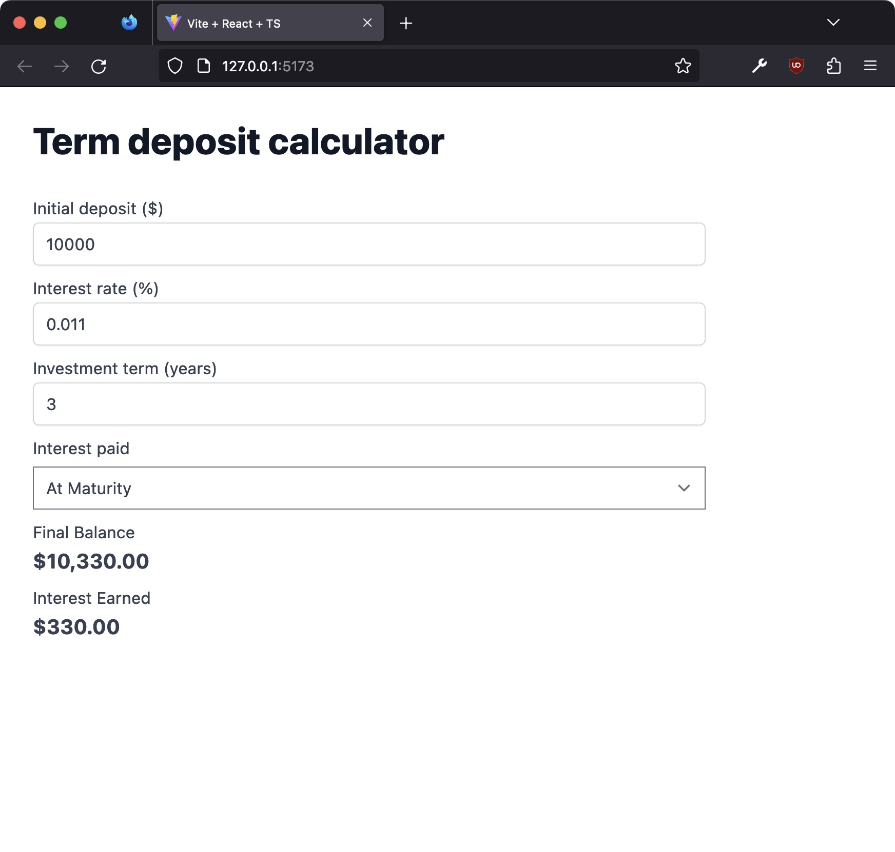

# Term deposit calculator UI

A simple user-interface for a term deposit calculator built with React, Vite, Typescript and Tailwind CSS.

## Get Started

1. Install dependencies `yarn install`
1. Start dev server `yarn start`

## Linting and formatting

For linting and formatting, we use ESLint and Prettier.

`yarn run lint`
`yarn run format`

## Testing

For testing we are using Jest.

`yarn run test`

## Build for production

`yarn run build`
